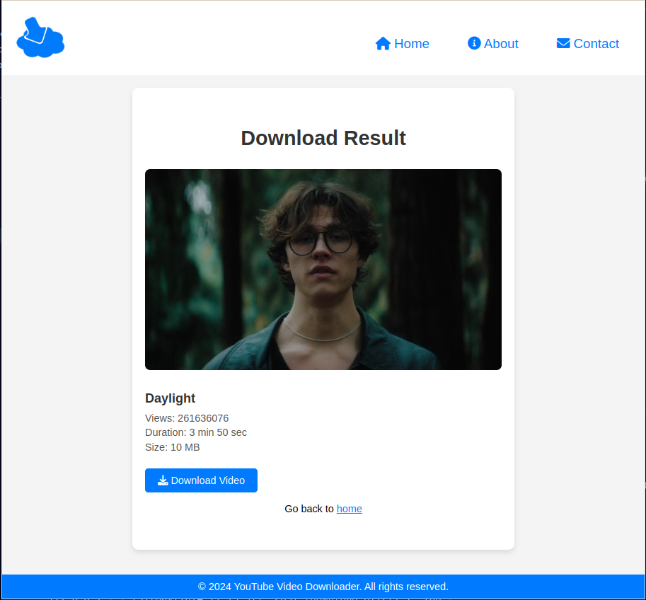

# YouTube Downloader using Flask

This is a simple web application built with Flask that allows users to download YouTube videos.




## Features

- **Download YouTube Videos**: Users can input the URL of a YouTube video and download it directly from the web app.
- **Display Video Information**: Before downloading, the web app displays information about the video, such as title, views, length, and cover image.
- **Error Handling**: If any errors occur during the download process, users are redirected to an error page displaying the error message.

## Installation

1. Clone the repository:

    ```bash
    git clone https://github.com/your-username/youtube-downloader-flask.git
    ```

2. Install the required Python packages:

    ```bash
    pip install -r requirements.txt
    ```

## Usage

1. Run the Flask app:

    ```bash
    python app.py
    ```

2. Open your web browser and go to [http://localhost:5000/](http://localhost:5000/).

3. Enter the URL of the YouTube video you want to download and click the "Download" button.

4. The web app will display information about the video and provide a download link. Click the link to download the video.

## Configuration

- The `DOWNLOAD_FOLDER` variable in `app.py` specifies the directory where downloaded videos will be saved. You can change this to a different directory if needed.

## Contributing

Contributions are welcome! If you find any bugs or have suggestions for improvements, please open an issue or submit a pull request or you can mail me in this address - [Email](arijitmondal200430@gamil.com).

## License

This project is licensed under the MIT License - see the [LICENSE](LICENSE) file for details.
